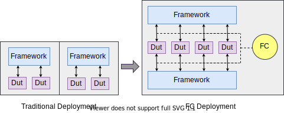

What is FC?
-----------

FC (Framework Coordinator), is an open source coordinator service among different embeded frameworks.
It's built using the same principles as `Mesos <http://mesos.apache.org/>`_, provides different frameworks (e.g., LAVA, Labgrid) with API's for
resource management and scheduling across entire board farms.

Background
----------

There are many different systems in embedded test community, see `this <https://elinux.org/Test_Systems>`_. They are good at different scenarios, e.g.

* **Test automation:**

  LAVA, Fuego, autotest, avocado, TI VATF, U-Boot test tool, CI-RT R4D, Baylibe Lab in a Box......

* **Development automation:**

  Labgrid......

Let's take a look at why FC is useful by going back in time.

* **Traditional deployment era:** Early on, as nearly all above systems require dedicated control of the board resources, organizations have to
  afford multiple series of hardware to meet the requirements of different frameworks, which leads to resource waste when leverage different systems.
* **FC deployment era:** As a solution, FC was introduced. It allows different frameworks could share same series of hardware, move resources between
  systems seamlessly. Different systems will continue work without aware existence of other systems. So, FC could be treat as "scheduler's scheduler".
  The initial idea comes from `Jan's proposal to move boards between LAVA and labgrid on ATS2019 <https://elinux.org/Automated_Testing_Summit_2019>`_,
  we realized the FC based on that thought (Thanks community to inspire the idea).

Compared to other resource management system, it has low invasion to frameworks. This means: unlike mesos which you should write your mesos scheduler
for your framework & inject it into your framework code, FC won't change your framework code, it tries to adapt to your framework.
But still, your framework need next two features:

* Your framework needs to have a job queue which FC could monitor.
* Your framework needs to have ways to let FC control resource's availability, temporary connect/disconnect from your framework.

Supported frameworks
--------------------

FC is designed as a plugin system to support different frameworks, it currently supports:

* **LAVA:** use it for test automation
* **Labgrid:** use it for development automation

But, it not limits to above two, you could write your own plugins to support other framework.

For more detail, move your steps to `FC home page <https://fc.readthedocs.org/>`_.

