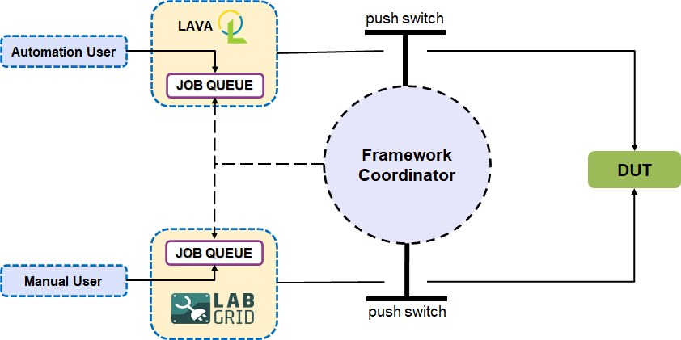

Overview
========

Architecture
------------

As mentioned in above diagram, ``FC`` will make all frameworks can't access resources through different frameworks' interface.
Then, ``FC`` will monitor the job queue of different frameworks, if find some framework job pending on any resource, ``FC`` will allow resource access to that framework. With that way, no conflict will be occured.

Components
----------

``FC`` has three main components inside:

1. fc-server
++++++++++++

``fc-server`` is the main program to coordinate different frameworks.

(I) api server
##############

There is an API server located on port 8600, it afford ``REST`` api for ``fc-client`` & ``fc-guarder``.

(II) plugins
############

* **lava:** it will control resource by switch resource status between "GOOD" & "MAINTENANCE".
* **labgrid:** it will control resource by inject system level labgrid reservation.

(III) extra feature
###################

Besides fair scheduler which ``FC`` afford resources to all frameworks fairly, there is a feature called ``priority scheduler``, with which high priority framework could seize resource from low priority framework.

2. fc-client
++++++++++++

``fc-client`` is the client program to query resource information from ``fc-server``, meanwhile, it could help to reserve boards.

3. fc-guarder
+++++++++++++

``fc-guarder`` is the guard program to monitor ``fc-server``, if ``fc-server`` down for any reasons, the ``fc-guarder`` will online all lava devices to make resources still could be used by LAVA.
